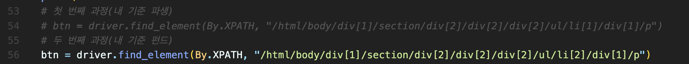

# 동영상 강의 자동 넘김 프로그램
<br>

안녕하세요 수협은행 23사번 동기 여러분 😊

IT지원부 개발지원팀 황인빈 입니다.

4/30 까지 들어야 하는 펀드, 파생 강의 혹시 다들 이미 들으셨는지 모르겠습니다.

혹시 귀찮지 않았나요? 저는 너무나 귀찮았습니다.

언제 그거 하나하나 손으로 2분 6분 7분마다 신경써서 다음 누르고 있겠습니까.

그런 단순 노동을 하기에 제 시간은 너무나 소중합니다. 여러분의 시간도 마찬가지겠지요?

그래서 자동화 코드를 한 번 짜보았습니다.

그냥 제 환경(Mac OS, 내 인터넷 속도)에 최적화하여 돌아가게끔 해서

정교하게 만들지는 않았고, 하드코딩 한 거라 수많은 버그와 예외사항이 있을 수 있습니다.

해당 사항은 이따 말씀 드리겠습니다.

아무쪼록 여러분에게 도움이 되었으면 좋겠네요.

---

<br>
<br>

# 준비사항

이 프로그램을 사용하기 위해서는 몇 가지 준비사항이 필요합니다.

1. 지금 이거 다운로드
2. Python 설치
3. Selenium install
4. Chrome 드라이버 설정
5. login.txt 파일 수정

- 이 프로젝트 파일 다운로드

    ```
    git에 익숙하신 분들은 클론 하거나 포크 뜨거나 알아서 하시면 되고, 
    그냥 zip 다운 받으셔서 로컬에 압축 풀어도 됩니다.
    ```
    


- Python
  
    ```
    "Life is short, You need Python"

    Python 은 생산성이 좋다는 특징을 가지고 있는, 프로그래밍 언어 중 하나로,
    이를 가지고 많은 일들을 할 수 있습니다. 
    궁금하시면 찾아보시길 바라고, 

    자신의 PC에 Python을 설치해야 합니다.
    Mac OS라면 이미 설치되어 있을 것이고,
    Window를 쓰시는 분들은 설치를 해야 합니다.
    
    설치법 검색하셔서 설치를 해주세요.
    이 링크 보셔도 되고 직접 찾아보셔도 됩니다.
    
    https://wikidocs.net/44
    ```

- Selenium

    ```
    Selenium 웹 브라우저 자동화를 가능하게 하는 프레임워크 입니다.
    Python을 설치하신 후에 Selenium 라이브러리를 다운받으시면 되는데,
    
    -   Mac OS 의 경우 터미널을 여셔서,
        pip install selenium 
        명령어 입력

    -   Windows 의 경우 명령 프롬프트를 켜서
        pip install selenium 
        명령어 입력
    
    (윈도우는 앞에서 Python 설치할 때 환경변수 설정 이런 거 다 하지 않았으면 pip 안 먹힐겁니다.)
    
    인터넷에 "Selenium 설치" 라고 검색하시면 설치법 많이 나오니 참고해서 설치해주세요.

    https://chancoding.tistory.com/136
    ```

- Chrome Driver
  
    ```
    Selenium의 연장선으로 우리는 크롬 웹 브라우저를 자동화시킬건데, 그러기 위해서는 드라이버를 다운받아야 합니다.

    https://chancoding.tistory.com/136

    위 링크에 드라이브 파일 설정하는 법도 같이 나와있으니 참고하셔서 그대로 따라하시면 됩니다.
    ```

- login.txt 파일 수정

    ```
    저 파일을 열어서 
    첫 째 줄에 ID, 
    둘 째 줄에 Password 
    적으시고 저장 후 닫아주세요 .
    ```

---
<br>
<br>


# 실행법

Mac OS 는 터미널 창을 열어서, 

Windows 는 cmd 창을 열어서

    
    python pp.py
    

하시고 그냥 컴퓨터 계속 켜 놓으면 됩니다.


---

<br>
<br>


# 그 외

- 프로그램이 멈추면 브라우저를 끄고 다시 프로그램을 실행시키시면 됩니다. 
    단, <U>**끄기 전에 동영상을 0분0초로 돌려놓고 꺼야 합니다.**</U> 다음 프로그램 실행시 <이어보기> 가 되어 있으면 안 됩니다.

- 그리고 저희가 들어야 하는 강의가 파생, 펀드 두 개인데, 코드 안에 있는 주석을 해제, 처리함으로서 강의 변경하면 됩니다.
(둘 중 하나는 무조건 주석해야 합니다.)
(주석처리라 함은 코드 앞에 "#"를 붙이는 것을 말합니다.)



- 동영상의 절대적인 시간은 흘러야 합니다.
  이 프로그램은 그냥 버튼을 자동으로 눌러주고 다음 강의를 열어주는 것만 할 뿐이지, 0%를 바로 100%로 만드는 마법은 부릴 수 없습니다.

- 크롬 업데이트나 서버 상황에 따라 언제 막힐 지 모릅니다. 하지만 목적만 달성하면 되기에 그냥 딱 남은 며칠만 돌아가면 되는 거라 따로 업데이트나 이런 일은 없을 겁니다.


앞서 말씀드렸지만, 정말 가볍게 만든 코드라 여러 문제가 생길 수 있습니다.

중간에 멈출 수도 있고, 처음부터 안 돌아갈 수도 있습니다.

각자 로컬 컴퓨터의 환경이 다르고, 인터넷 속도가 다르고, 서버의 상황 등 수많은 변수가 있어서 그렇습니다.

설치 관련 문제는 충~~~~~~분히 검색해보시고 알아서 해주시고, 

설치는 다 했는데, 프로그램이 진짜 계속 너~~~~~~~~무 안 돌아간다 그러면 도와드릴게요.

아무런 예외 처리를 하지 않았고, 그냥 페이지 로딩을 위한 몇 초 간의 기다림을 하드코딩으로 때려박아서 돌아가게 만들었습니다.

어디서 멈추는 게 반복된다 그럴 때는 코드를 좀 아시는 분은 sleep 시간 변경해서 해보세요.


